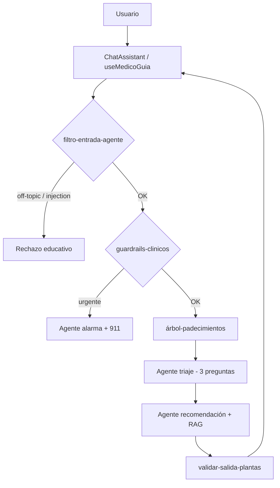

# Arquitectura del Médico Virtual — Farmacia Viva

**Basado en:** *A Practical Guide to Building Agents* (OpenAI)  
**Proyecto:** Farmacia Viva · VIC 2026  
**URL producción:** https://proyecto-gzlfs.vercel.app/asistente

---

## 1. Visión general

El Médico Virtual es un **agente conversacional** con orquestación por fases, herramientas (tools) sobre catálogo real y capas de seguridad. No es un chat genérico: sigue un flujo clínico-educativo antes de recomendar plantas.



---

## 2. Capas del agente (PDF → implementación)

| Capa PDF | Módulo | Función |
|----------|--------|---------|
| Input filter | `filtro-entrada-agente.ts` | Bloquea off-topic e intentos de prompt injection |
| Guardrails | `guardrails-clinicos.ts` | Síntomas de alarma → escalamiento |
| Guardrails árbol | `guardrails-arbol.ts` | Alarma al llegar a hoja del árbol |
| Orquestación | `useMedicoGuia.ts` | Fases: árbol → triaje → recomendación → fin |
| Tools RAG | `rag.ts` | Recuperación pgvector + fichas |
| Tools catálogo | `plants.ts` | Búsqueda por padecimiento y tarjetas |
| Output validation | `validar-salida-plantas.ts` | Texto + tarjetas ⊆ contexto |
| Observabilidad | `agente-observabilidad.ts` | Eventos estructurados (dev) |
| Errores / reintentos | `agente-errores.ts` | Escalamiento tras 3 fallos de API |
| Evals | `medico-conversacion-pruebas.ts` | 22 escenarios automatizados |

---

## 3. Tools (herramientas)

### 3.1 `buscarContextoRAG` (`rag.ts`)

| Campo | Valor |
|-------|-------|
| **Entrada** | Consulta + historial opcional + `plantasContextoIds` |
| **Salida** | Fragmentos `PlantEmbedding` (máx. 3) |
| **Cuándo** | Chat libre, recomendación, consulta planta |

### 3.2 `buscarPlantasParaRecomendacion` (`plants.ts`)

| Campo | Valor |
|-------|-------|
| **Entrada** | `PadecimientoSeleccionado` + notas de triaje |
| **Salida** | `PlantaCatalogo[]` rankeadas por síntoma |
| **Cuándo** | Fase recomendación del guía |

### 3.3 `buscarPlantasParaTarjetas` (`plants.ts`)

| Campo | Valor |
|-------|-------|
| **Entrada** | Consulta + historial + texto de respuesta del LLM |
| **Salida** | `PlantaMedicoVirtual[]` para UI |
| **Cuándo** | Tarjetas tras respuesta (guía y chat libre) |

### 3.4 `evaluarGuardrailClinico` (`guardrails-clinicos.ts`)

| Campo | Valor |
|-------|-------|
| **Entrada** | Mensajes del usuario |
| **Salida** | `urgente` / `precaucion` / `ninguno` |
| **Cuándo** | Cada mensaje del paciente en el guía |

### 3.5 `validarYSanitizarSalidaPlantas` (`validar-salida-plantas.ts`)

| Campo | Valor |
|-------|-------|
| **Entrada** | Texto LLM + plantas del contexto RAG |
| **Salida** | Texto (con aviso si aplica) + `plantasParaTarjetas` |
| **Cuándo** | API `/api/chat/guia` (recomendación y consulta planta) |

---

## 4. APIs

| Ruta | Fase / uso |
|------|------------|
| `POST /api/chat` | Chat libre (streaming) + filtro entrada |
| `POST /api/chat/guia` | Triaje, recomendación, consulta planta |
| `POST /api/chat/plantas` | Tarjetas; opción `restringirAContextoRAG` |

---

## 5. Flujo del guía (sin alterar lógica de triaje)

1. Usuario describe malestar → **filtro entrada** → **guardrail**
2. **Árbol** canaliza padecimiento → **guardrail árbol** en hoja
3. **Triaje**: máximo 3 preguntas (`medico-agentes.ts`)
4. Cierre automático → **recomendación** con RAG
5. **Validación salida** → tarjetas solo de plantas mencionadas
6. Fase `fin`: consultas de seguimiento sobre plantas

---

## 6. Pruebas automatizadas

```bash
cd web
npm run medico:pruebas   # 22 escenarios — flujo agente
npm run rag:pruebas      # 15 escenarios — recuperación RAG
```

---

## 7. Variables de entorno

| Variable | Uso |
|----------|-----|
| `NEXT_PUBLIC_SUPABASE_URL` | Catálogo + RAG |
| `NEXT_PUBLIC_SUPABASE_ANON_KEY` | Lectura pública |
| `DEEPSEEK_API_KEY` | Triaje, recomendación, chat |
| `GOOGLE_GENERATIVE_AI_API_KEY` | Embeddings de consulta (opcional) |

---

## 8. Pendiente futuro (no bloqueante)

- Evals E2E con LLM real (5–10 casos con costo API)
- Modelos distintos por tarea (clasificación vs generación)
- Anti prompt-injection con modelo dedicado
